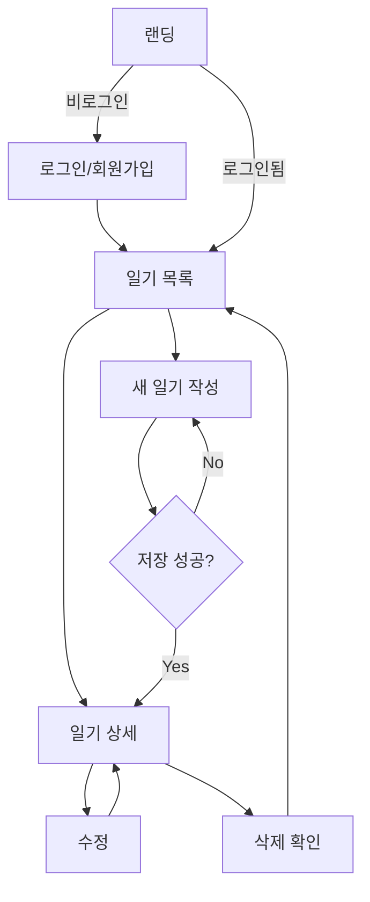

# User Flow — 유저 플로우

> **프로젝트**: Nhật ký của bạn

---

## 1. 신규 사용자 온보딩

```
[랜딩] → [회원가입] → [이메일 인증(선택)] → [일기 목록(빈 상태)] → [첫 일기 작성 CTA]
```

### 상세
1. 비로그인 사용자는 랜딩 페이지에서 서비스 소개 확인
2. "시작하기" 클릭 → 회원가입 폼
3. 가입 완료 → 자동 로그인 → 일기 목록 (빈 상태 + "첫 일기 쓰기" 버튼)

---

## 2. 로그인 사용자 — 일기 작성

```
[일기 목록] → [+ 새 일기] → [작성 폼] → [저장] → [일기 상세] → [목록으로]
```

### 상세
1. 목록에서 "+" 또는 "새 일기" 클릭
2. 제목, 본문, 날짜(기본: 오늘), 기분, 태그 입력
3. "저장" → 유효성 검사 통과 시 DB 저장 → 상세 페이지로 이동
4. 저장 실패 시 인라인 에러 메시지, 폼 데이터 유지

---

## 3. 일기 조회·수정·삭제

```
[일기 목록] → [카드 클릭] → [일기 상세]
                              ├→ [수정] → [작성 폼(편집)] → [저장] → [상세]
                              └→ [삭제] → [확인 모달] → [삭제 완료] → [목록]
```

---

## 4. 검색·필터

```
[일기 목록] → [검색창 입력] → [실시간 필터 결과]
           → [태그 클릭] → [태그별 필터 결과]
```

---

## 5. 로그아웃

```
[설정/프로필] → [로그아웃] → [랜딩 또는 로그인]
```

---

## 6. 에러·엣지 케이스

| 상황 | 동작 |
|------|------|
| 세션 만료 | 로그인 페이지로 리다이렉트 + 토스트 |
| 네트워크 오류 | 재시도 버튼 + 오프라인 안내 |
| 빈 제목/본문 저장 시도 | 필드별 validation 메시지 |
| 삭제 취소 | 모달 닫기, 변경 없음 |

---

## 7. 플로우 다이어그램 (Mermaid)


