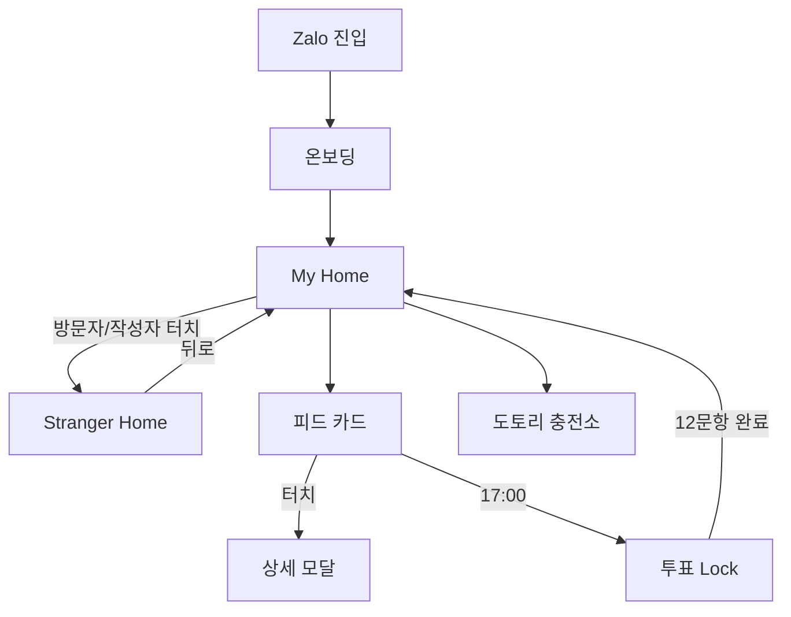

# User Flow — 유저 플로우

> **프로젝트**: 너의 다이어리 (Nhật ký của bạn)

---

## 1. Zalo 최초 진입 (온보딩)

```
[Zalo 미니앱 실행] → [Zalo 프로필 연동] → [학교·학급 선택] → [힌트 데이터 입력] → [메인 홈]
```

### 상세
1. Zalo 원터치 간편 가입 (별도 가입 폼 없음)
2. 베트남 고등학교 + 학급(Lớp) 필수 선택
3. 힌트 데이터 1회 입력: 성별, 키 범위, MBTI 앞자리, 등교 수단
4. 완료 → 내 다이어리 홈 (My Home)

---

## 2. 메인 홈 — 내/타인 뷰

```
[My Home] ←── Warp ──→ [Stranger Home]
     │                        │
     ├ 캘린더/사진첩 편집      ├ 읽기 전용
     ├ 비밀 카드 작성          ├ 방명록만 작성
     └ 피드 스와이프           └ 워프 시 전면광고
```

### 워프 트리거
- 최근 방문자 틱커 터치
- 피드/댓글 작성자(🤫 익명 영역) 터치
- 21:00 투표 지목 알림 → 투표자 홈피

---

## 3. 피드 카드 인터랙션

```
[카드 스택] ─가로 스와이프→ [게시판 전환: 일기장|학교|투표|방명록]
           ─세로 스와이프→ [다음/이전 카드]
           ─터치→ [상세 모달: 미디어+댓글]
```

---

## 4. 5시 투표 하이재킹

```
[17:00 푸시] → [5층 투표 카드 자동 전환] → [Lock 활성]
    → [12문항 실명 투표] → [힌트 실드 선택] → [제출] → [Lock 해제]
    → [21:00 지목 알림] → [피드 카드 터치] → [워프 수사]
```

### Lock 중 차단
- 좌우 카드 스와이프
- 다른 홈피 워프
- 일기장 탐색

---

## 5. 도토리 충전

```
[상단 🌰 터치] → [충전소]
    ├ 보상형 동영상 (15~30초) → +2 도토리
    ├ 오퍼월 미션 (쇼피/틱톡) → +2~3 도토리
    └ 제휴 커머스 클릭 → 딥링크
```

---

## 6. 실시간 알림

| 이벤트 | 모달 메시지 |
|--------|-------------|
| 반 친구 가입 | "같은반 친구가 들어왔습니다." |
| 새 학교 게시글 | "학교게시판에 새로운 글이 올라왔습니다." |

---

## 7. 에러·엣지 케이스

| 상황 | 동작 |
|------|------|
| Profanity Shield BLOCK | 입력 거부 + 안내 토스트 |
| 5자/10자 초과 | 입력 차단 (maxLength) |
| 투표 Lock 중 스와이프 | 시각적 저항 + 안내 |
| 광고 로드 실패 | 재시도 버튼 |
| 네트워크 오류 | 오프라인 배너 |

---

## 8. 플로우 다이어그램


